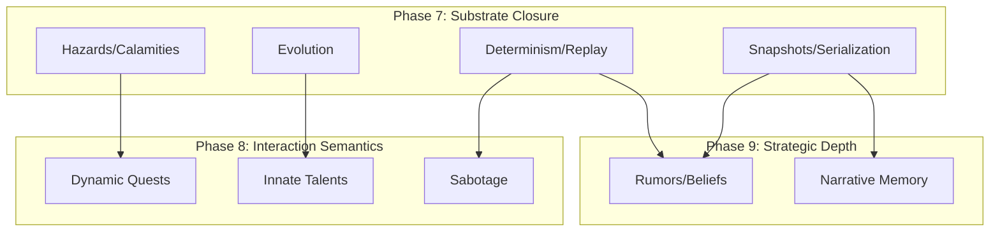

# Investigation: Phase 7 Downstream Blockers

## Dependency Analysis

Phase 7 (Substrate Closure) serves as the "Hardened Foundation" for all semantic recovery in Phases 8 and 9. Failure to close Phase 7 substrate logic will lead to architectural drift and non-deterministic behavior in future high-level features.

### 1. Direct Blockers (Structural)

| Future Item | Blocked By (Phase 7) | Rationale |
| :--- | :--- | :--- |
| **LEG-RPG-141 (Quests)** | **LEG-RPG-071 (Hazards)** | Dynamic quests require a stable hazard system for objective placement and difficulty scaling. |
| **LEG-RPG-141 (Quests)** | **LEG-RPG-139 (Calamities)** | Quest availability and urgency are driven by world-wide calamity triggers. |
| **LEG-RPG-150 (Rumors)** | **LEG-RPG-159 (Serialization)** | Social belief state (Rumors) requires hardened serialization to persist across simulation restarts. |
| **LEG-RPG-151 (Memory)** | **LEG-RPG-068 (Snapshots)** | Narrative memory requires deep-immutability guards to prevent "memory corruption" during world-state rolls. |
| **LEG-RPG-144 (Talents)** | **LEG-RPG-143 (Evolution)** | Innate talents (Genetics) are specialized mutations of the base Entity Evolution/Archetype system. |

### 2. Indirect Blockers (Certification/Replay)

| Feature Area | Blocked By (Phase 7) | Rationale |
| :--- | :--- | :--- |
| **Tactical AI (8/9)** | **LEG-RPG-070 (Replay)** | Complex tactical maneuvers (Flanking, Cover) cannot be audited or balanced without bit-identical replay reconstruction. |
| **Combat Depth (8/9)** | **LEG-RPG-006 (Conflict)** | Multi-unit combat encounters rely on the deterministic resolution of simultaneous actions to prevent desync. |
| **World Persistence** | **LEG-RPG-066 (World Gen)** | Procedural world persistence relies on seed-identical reconstruction of hazardous zones and calamity impacts. |

## Dependency Map (Summary)

## Critical Path Assessment

Phase 7 **Substrate Hardening** (001, 004, 006, 066, 068, 070, 073, 159) is the **Critical Path** for 100% of future semantic recovery. Without a deterministic substrate, Phases 8 and 9 cannot achieve "Authoritative" status.
