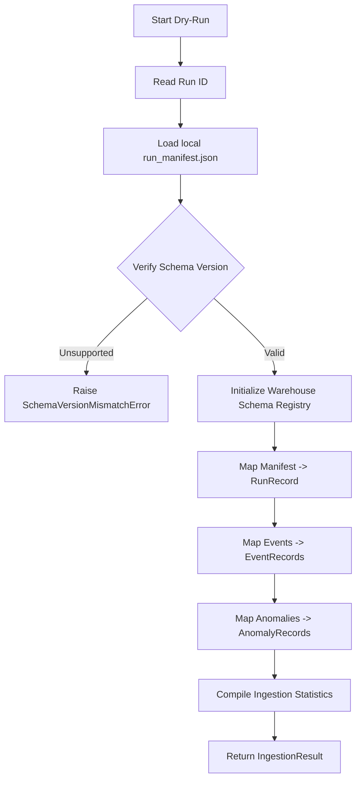

# Investigation: Warehouse Schema and Adapter Interface

## 1. Existing Local Artifact Architecture

The RPG simulation engine currently writes the following telemetry files to disk under the local `data/runs/{run_id}/` and `data/run_sets/{sweep_id}/` paths:

1. **`run_manifest.json`** (`RunManifest`):
   Contains scenario name, type, seed, ticks requested, ticks completed, status, started_at, ended_at, and versioning properties (`observability_version`, `artifact_schema_version`).
2. **`simulation_events.jsonl`** (`SimulationEvent`):
   Line-separated JSON objects detailing spacetime occurrences with `tick`, `event_type`, `event_category`, `severity`, `entity_id`, `region_id`, `quest_id`, `faction_id`, `message`, and dynamic `payload` attributes.
3. **`hard_law_violations.jsonl`** (`HardLawViolation`):
   Line-separated records detailing physics/invariant violations, including type, tick, severity, actor/target references, and error payloads.
4. **`anomalies.json`** (`AnomalyReport`):
   A JSON list of post-run rule violation incidents parsed by rule-engine diagnostics.
5. **`run_report.json`**:
   Summary metadata and aggregated diagnostic metrics of a completed run.

---

## 2. Decoupling and Schema Mapping Requirements

To isolate the core simulation loop from database engines, we must map these diverse, unstructured, or semi-structured JSON datasets into standard relational records under `warehouse_schema_v1`.

### Key Design Constraint: Payload Field Preservation
As per Milestone 34 guidelines, **payload fields must be kept as JSON-serialized strings**. This avoids schema fragmentation, ensuring the warehouse remains robust even when the engine's core mechanics or telemetry attributes evolve.

---

## 3. Logical Table Mapping Design

| Warehouse Record | Source Artifact | Key Columns | JSON Payload Field |
| :--- | :--- | :--- | :--- |
| **`RunRecord`** | `run_manifest.json` | `run_id`, `scenario_name`, `scenario_type`, `seed`, `status`, `health_score`, `ticks_completed`, `started_at`, `ended_at` | `manifest_json` (raw manifest copy) |
| **`SweepRecord`** | `sweep_summary.json` | `sweep_id`, `scenario_name`, `scenario_type`, `total_runs`, `completed_runs`, `failed_runs`, `average_health_score` | `summary_json` (raw summary copy) |
| **`EventRecord`** | `simulation_events.jsonl` | `run_id`, `tick`, `event_type`, `event_category`, `severity`, `entity_id`, `region_id`, `quest_id`, `faction_id`, `message` | `payload_json` |
| **`MetricWindowRecord`**| `metric_windows.jsonl` | `run_id`, `window_start_tick`, `window_end_tick`, `tick_compute_ms_avg`, `tick_compute_ms_p95`, `memory_rss_bytes_avg`, `alive_entities_avg` | `metrics_json` |
| **`AnomalyRecord`** | `anomalies.json` | `run_id`, `rule_id`, `severity`, `domain`, `tick_start`, `tick_end`, `affected_entity_count`, `message` | `evidence_json` |
| **`HardLawViolationRecord`**| `hard_law_violations.jsonl` | `run_id`, `tick`, `violation_type`, `severity`, `actor_id`, `target_id`, `message` | `evidence_json` |
| **`BaselineRecord`** | `baseline.json` | `run_id` or `scenario_name`, `created_at`, `health_score_threshold`, `tps_threshold` | `baseline_json` |
| **`ComparisonRecord`** | `comparison_results.json` | `run_id`, `baseline_run_id`, `health_score_delta`, `status` | `comparison_json` |

---

## 4. Ingestion Dry-Run Workflow

To support safe validation:

This flow guarantees developer utility without requiring a running ClickHouse database.
