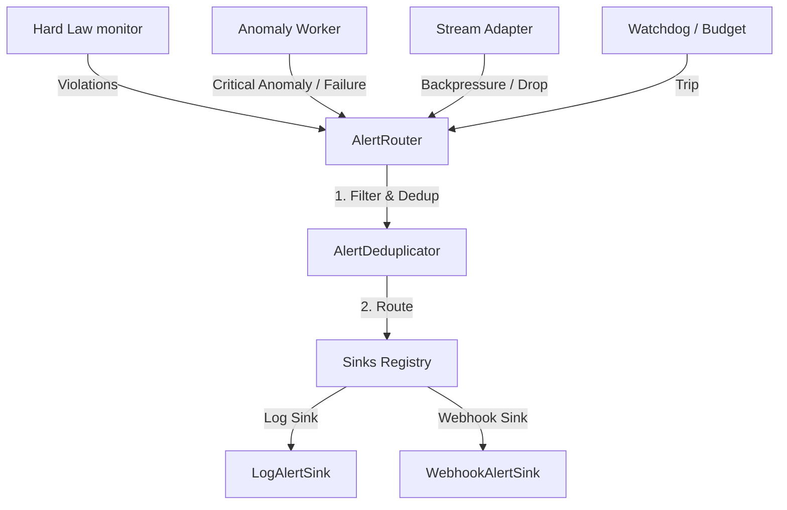

# Plan — Milestone 40: Alert Routing and Incident Workflow

This plan outlines the architecture, data models, routing pipeline, and integration paths for the production-grade Alert Routing system.

---

## 🎯 Objectives

1. Define a robust and lightweight alert event schema (`AlertEvent`) that serializes cleanly to JSON.
2. Build an `AlertDeduplicator` to prevent alert fatigue by ignoring identical alerts within a sliding 60-second window.
3. Build an `AlertRouter` that routes structured alerts to a set of registered and configurable sinks (e.g. logs, webhooks).
4. Implement two concrete sinks:
   - `LogAlertSink`: logs alerts to stdout/stderr.
   - `WebhookAlertSink`: POSTs structured JSON payloads to an external HTTP webhook with robust timeout, retries, and error handling.
5. Integrate alert triggers for:
   - Hard law invariant violations.
   - Live anomaly worker failures/critical anomalies.
   - Real-time event stream backpressure/dropped events.
   - Watchdog trips (such as thread deadlocks or ticks exceeding budget).

---

## 🏗️ Architectural Design



### 1. AlertEvent Schema
- `alert_id` (str, uuid4)
- `alert_type` (str, e.g. "HardLawViolation", "WatchdogTrip", "CriticalAnomaly", "StreamBackpressureHigh")
- `severity` (str, e.g., "INFO", "WARNING", "ERROR", "CRITICAL")
- `run_id` (str)
- `sweep_id` (Optional[str])
- `tick` (Optional[int])
- `message` (str)
- `evidence` (Dict[str, Any])
- `dedup_key` (str)
- `created_at` (str, ISO-8601 UTC timestamp)

### 2. Deduplication Policy
- Key generation: `dedup_key = f"{run_id}:{alert_type}:{dedup_key_suffix}"`.
- Deduplication window: 60 seconds (configurable). If an alert with the same key is processed within this window, it is suppressed.

### 3. Sinks
- **Log Sink**: enabled by default, maps to Python's logging library.
- **Webhook Sink**: disabled by default, takes an external HTTP URL, performs retry limits (up to 3 times) and timeout (5.0s max), catches all network exceptions, and logs them without interrupting the simulator kernel or workers.

---

## 📂 Proposed File Layout

```text
src/observability/alerts/
  ├── __init__.py
  ├── models.py         # AlertEvent and other type definitions
  ├── deduplicator.py   # AlertDeduplicator implementation
  ├── router.py         # AlertRouter implementation
  ├── sinks.py          # LogAlertSink, WebhookAlertSink base and implementations
  └── manager.py        # Centralized Alerts Manager for easy access/config
```

---

## 🧪 Integration Points

1. **Hard Law Violation**: In `Kernel._run_hard_law_checks`, when violations are detected, we will construct an `AlertEvent` for each violation and forward it to `AlertRouter`.
2. **Watchdog Trip**: In `Kernel.tick_once`, if a tick exceeds the time budget and has to drop work or has governor anomalies, trigger an alert.
3. **Critical Anomaly / Anomaly Worker Failure**: In `src/observability/anomaly/worker.py`, when a worker encounters an unhandled exception or detects a critical anomaly, dispatch an alert.
4. **Stream Backpressure**: In the event publisher/stream adapter, if the dropped events queue delta or event buffer exceeds high limits, emit a backpressure alert.
