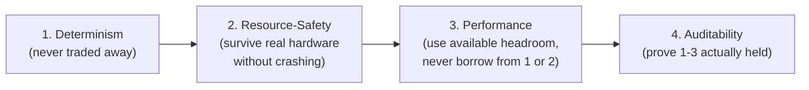
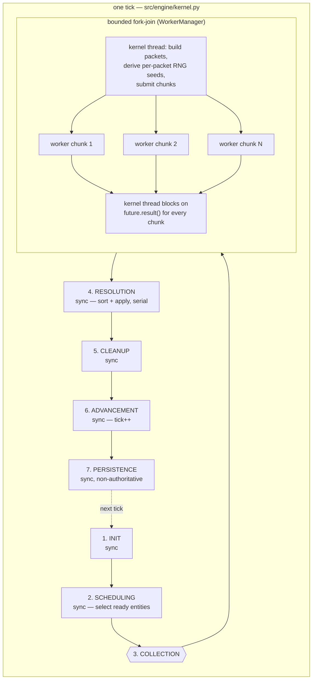
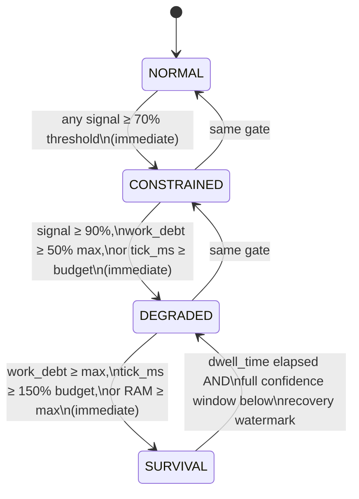

# Investigation — TCK-20260817-KERNEL-CONCURRENCY-DESIGN-DOC

## Current Behavior

**Source file**: `docs/plans/kernel_concurrency_design_review_proposal.md` (367 lines, frontmatter
`status: active, layer: engine, authority: P2, audience: agent`).

**Appendix A location** (task 1): heading `## Appendix A — Drafted content for C1` is at line 182.
The drafted doc itself is wrapped in a fenced code block, ` ```markdown ` opening at line 192 and
closing ` ``` ` at line 367 (the file's last line) — i.e. the entire remainder of the file after
line 182 is Appendix A plus its 8-line intro paragraph (183-190) and the ephemeral-artifact
callout (189-190). Inside the fence:
- Its own frontmatter: lines 193-198 (`status: draft, layer: engine, authority: P2,
  audience: developer`).
- Title `# Kernel Concurrency Model & Design Philosophy`: line 200.
- Purpose: 202-208.
- **Part 1 — Design Philosophy**: 210-225.
- **Part 2 — The tick loop, with Collection expanded**: 227-248.
- **Part 3 — How Collection avoids race conditions**: 250-281.
- **Part 4 — Performance under pressure**: 283-327.
- **Part 5 — Benchmarking integrity**: 329-336.
- `## Known documentation drift`: 338-350.
- `## References`: 352-366.

5 Parts confirmed present. The repo copy has **zero** mermaid diagrams (dropped when pasted into
the fence), but all 4 real diagrams (not 2 as the ticket's AC states) were recovered from the
still-reachable ephemeral artifact link and are captured verbatim at the bottom of this document
under "Recovered Diagram Source" — see Risks item 1 for the full resolution.

**Task 2 — internal "Known documentation drift" section**: there is only one heading anywhere in
the file literally titled "Known documentation drift" — it is line 338, *inside* Appendix A's
fence, not a separate top-level section. (There is no separately-headed top-level "Known
documentation drift" section outside the fence; the outer document narrates the same material as
individual `C2`/`C3`/`C8` items with their own `**Update (...)**` annotations at lines 47-52,
65-70, and 347-350 respectively.) Appendix A's internal copy (lines 338-350) lists the same 3
items and has an `**Update (TCK-20260817-AUDIT-ENGINE-DOCS-DRIFT, closed 2026-08-21)**` annotation
for item 3 only (hardware-class conflict / C8). **Items 1 (concurrency contradiction / C2) and 2
(phase-count contradiction / C3) have no resolution annotation inside the fence**, even though the
outer C2 (line 47) and C3 (line 65) sections confirm both are closed as of 2026-08-21. This
confirms the ticket's own Assumptions note: this section will read as stale the moment it lands
verbatim and must be updated (recommend the same in-place "Update (...)" treatment already used
for item 3, not silent deletion — deleting would lose the institutional memory of what was wrong
and how it was fixed).

**Task 3 — the two open-question pointers**:
- **RNG-in-Collection (Part 3, lines 277-281)**: already updated. Reads "Open question, now
  resolved (TCK-20260817-DOC-COLLECTION-RNG-CONSUMPTION, closed 2026-08-21, see C7 above)" with a
  cross-link to `simulation_kernel_contract.md` §7.1. No action needed here.
- **`concurrency_limit` rationale (Part 4, lines 305-308)**: **NOT** updated. Still reads "(see C6
  in the parent proposal — this rationale isn't written down anywhere else)" even though the outer
  C6 section (lines 129-134) confirms `TCK-20260817-DOC-CONCURRENCY-LIMIT-RATIONALE` closed
  2026-08-21, and the rationale is in fact now written down in two places: a docstring on
  `GovernorPolicy.from_mode()` (`src/engine/policy.py`) and
  `docs/engine/contracts/bounded_concurrency_contract.md` §5.1 (confirmed by reading that contract
  directly — §5.1 "Why `concurrency_limit` Decreases as `RuntimeMode` Escalates", lines 49-76,
  and by parity ledger entry INFRA-365, see below). This pointer needs the same "now resolved"
  treatment Part 3 already got, for consistency, before/during extraction.

Note: the ticket's own Scope/Out-of-Scope language ("Preserve the two open-question pointers ...
as pointers to their respective tickets rather than resolving them inline") was written when both
underlying tickets were presumably still open. Both are now closed. Updating the stale
cross-reference text is not "resolving the rationale" (already done, elsewhere, by closed tickets)
— it is correcting a citation that would otherwise land already-wrong. Flagging this as a
scope-interpretation point for Plan rather than silently deciding it.

**Task 4 — frontmatter status** (confirmed): Appendix A's inner frontmatter (line 194) is
`status: draft` — not in the legal set. `tools/validate_frontmatter.py` line 44:
`STATUS_VALUES = {"authoritative", "active", "historical", "archive"}`. `"authoritative"` also
requires a `last_verified` field per line 193-195 of that validator — extra upkeep burden.
Sibling `docs/architecture/simulation_watchdog.md` frontmatter (read directly): `status: active,
layer: architecture, authority: P1, audience: developer` — no `last_verified` field. All four of
`docs/engine/kernel.md` and the three named contracts are also `status: active, authority: P1,
audience: developer`. Recommendation: `status: active`, `authority: P1` (not P2 — matches both the
sibling doc and the authority tier of everything this doc summarizes/narrates), `audience:
developer` (matches sibling and Appendix A's own draft value), `layer: architecture` (per this
ticket's own Assumptions note, already decided).

**Task 5 — cross-link check**: grepped `docs/engine/kernel.md`,
`docs/engine/contracts/{bounded_concurrency_contract,worker_contract,concurrent_integrity_contract}.md`
for `docs/architecture` — zero matches in all four. Confirmed no existing cross-link to a
design-philosophy doc (none exists yet). Best insertion points, read directly:
- `kernel.md`: `## ⚡ Concurrency & The Resolution Bottleneck` (lines 53-57) — the section already
  narrates "Concurrent Collection" / "The Singular Bottleneck," the exact subject of the new doc's
  Parts 2-3.
- `bounded_concurrency_contract.md`: `### 5.1 Why concurrency_limit Decreases as RuntimeMode
  Escalates` (line 49) — this section already contains the fuller, code-verified version of what
  Appendix A's Part 4 paragraph says (added by the now-closed `TCK-20260817-DOC-CONCURRENCY-LIMIT-
  RATIONALE`). The new doc's Part 4 should link here rather than let two docs restate the same
  mechanism divergently over time (the exact class of drift `C8`/`docs/audits/D25_engine_docs_drift.md`
  was raised to prevent).
- `worker_contract.md`: `## Purpose` (lines 10-11) — natural anchor since the new doc's Part 3
  narrates *why* this contract's laws (payload discipline, result semantics, deterministic
  equivalence) hold. **Caution**: this file is one of the 16 `docs/engine/manifest.json`
  `mandatory_documents` entries (confirmed by reading `manifest.json`), with
  `required_headers: ["Purpose", "Backpressure & Fallback Law"]` enforced by
  `tests/docs/test_doc_integrity.py::test_document_structural_compliance`. A cross-link insertion
  must not rename/remove either heading.
- `concurrent_integrity_contract.md`: `## Purpose` (lines 10-11) — this contract covers
  operational lifecycle (replay, startup, shutdown), which is a concrete instance of "Progressive
  Degradation" narrated in the new doc's Part 4/5; link there since there is no more specific
  RuntimeMode-ladder section in this file (RuntimeMode itself lives in `governor.py`/`policy.py`,
  not this contract).

**Task 6 — hand-off to `TCK-20260817-STATE-DESIGN-PRIORITY-ORDER`**: this ticket is **not** at
`tickets/inprogress/` as the ticket text assumed — it is still at
`tickets/todos/kernel-concurrency-design-review/TCK-20260817-STATE-DESIGN-PRIORITY-ORDER.md`
(status OPEN, not yet started; minor location discrepancy in this ticket's own framing, worth a
one-line Plan note, not an issue to fix here). Its Assumptions section (lines 71-75) explicitly
says it depends on this ticket landing first, that it has "near-identical unlanded 'priority
order' prose (Appendix A Part 1)," and that it should "quote/cross-link" the landed doc "rather
than independently drafting." Its own Out-of-Scope (line 39) confirms: "Landing the kernel
concurrency design doc itself ... is a separate ticket (TCK-20260817-KERNEL-CONCURRENCY-DESIGN-DOC)."
No action for this ticket beyond leaving Part 1's prose in a state that ticket can cleanly quote —
Plan should note the hand-off but not attempt to pre-emptively edit `project_lawbook_m10.md`.

**Task 7 — filename/path**: `docs/architecture/` currently holds two naming styles: dated design
docs (`2026-08-10-cognition-driven-adventure-eligibility-design.md` etc. — used for point-in-time
proposal-style docs) and plain `snake_case_topic.md` ADR/reference docs (`simulation_watchdog.md`,
`feature_pack_architecture.md`, `world_assembly_architecture.md`, `cognition_domain_ownership.md`,
`macro_interest_constraints.md`). Since this is a standing reference doc (not a dated point-in-time
proposal) mirroring `simulation_watchdog.md`'s role, the plain-`snake_case` style fits better.
Recommend: `docs/architecture/kernel_concurrency_design_philosophy.md` — matches the doc's own
internal title ("Kernel Concurrency Model & Design Philosophy") and the existing naming pattern.

**Task 8 — `docs/audits/D25_engine_docs_drift.md` overlap**: grepped for
`appendix|concurrency design|design philosophy|kernel_concurrency` — zero matches. D25 does not
reference or duplicate Appendix A content. (Aside, out of this ticket's scope since D25 isn't in
this ticket's Related Docs: D25 line 88 still cites `TCK-20260817-FIX-CONCURRENCY-DOC-CONTRADICTION`
as `status OPEN`, which is now stale relative to that ticket's actual closed status — pre-existing
staleness in a document this ticket doesn't touch, flagged for awareness only.)

## Mechanics / Engine Constraints

This is a pure documentation-extraction ticket — no simulation law changes. The constraint is
**parity of narration, not mechanics**: the new doc must not contradict, or drift from, the four
P1 contracts it summarizes (`kernel.md`, `bounded_concurrency_contract.md`, `worker_contract.md`,
`concurrent_integrity_contract.md`) or `docs/engine/contracts/simulation_kernel_contract.md` §7.1
and §9, all read directly above and confirmed internally consistent with each other and with
Appendix A's prose as of this investigation (post the two now-closed contradiction-fix tickets).

## Docs Requiring Update

- `docs/architecture/kernel_concurrency_design_philosophy.md`: new doc — the extraction target;
  frontmatter corrected to `status: active, authority: P1, audience: developer, layer:
  architecture`; the two stale internal items in "Known documentation drift" updated; the
  `concurrency_limit` open-question pointer updated to "now resolved" to match the RNG pointer's
  existing treatment; mermaid diagrams sourced or authored (see Risks — blocking open question).
- `docs/engine/kernel.md`: add a cross-link to the new doc near the "⚡ Concurrency & The
  Resolution Bottleneck" section (line 53), required by this ticket's own acceptance criteria.
- `docs/engine/contracts/bounded_concurrency_contract.md`: add a cross-link to the new doc near
  §5.1 (line 49), required by this ticket's own acceptance criteria.
- `docs/engine/contracts/worker_contract.md`: add a cross-link to the new doc near `## Purpose`
  (lines 10-11), required by this ticket's own acceptance criteria; preserve both
  manifest-required headers exactly.
- `docs/engine/contracts/concurrent_integrity_contract.md`: add a cross-link to the new doc near
  `## Purpose` (lines 10-11), required by this ticket's own acceptance criteria.
- `docs/plans/kernel_concurrency_design_review_proposal.md`: add a `**Update (...)**` annotation
  under `## C1` (after line 35), matching the pattern already used for C2/C3/C6/C7/C8, pointing to
  the new landed doc — otherwise this proposal doc is left inconsistent (5 of 6 addressed items
  annotated, C1 silently not) once this ticket closes. Not explicitly named in the ticket's Scope
  but follows the doc's own established self-consistency pattern; flagging for Plan to confirm.
- `docs/parity_ledger/infrastructure.yaml` (optional, not required): INFRA-365 and INFRA-366's
  `v2_evidence` fields could append the new doc's path as an additional narrative-evidence pointer
  once it lands. Not a status/behavior change, so not mandatory — noting as a nice-to-have only.

## Parity Ledger Overlap

- `INFRA-365` (`infrastructure.yaml`, status `verified`, priority `P2`) — the `concurrency_limit`
  rationale, `v2_evidence` already cites `bounded_concurrency_contract.md §5.1`. Overlaps Part 4's
  stale pointer (above). Not P0, no blocking test_path requirement triggered by this ticket.
- `INFRA-366` (`infrastructure.yaml`, status `verified`, priority `P2`) — the concurrency
  contradiction fix (C2). Overlaps Appendix A's internal "Known documentation drift" item 1.
- `INFRA-367` (`infrastructure.yaml`, status `verified`, priority `P2`) — the phase-count
  contradiction fix (C3). Overlaps Appendix A's internal "Known documentation drift" item 2.

No P0 entries touched. This ticket does not need to add or modify parity ledger status — it is
extracting/cross-linking documentation, not changing verified behavior.

## Prior Work

- `TCK-20260817-FIX-CONCURRENCY-DOC-CONTRADICTION`, `TCK-20260817-FIX-PHASE-COUNT-CONTRADICTION`,
  `TCK-20260817-DOC-CONCURRENCY-LIMIT-RATIONALE`, `TCK-20260817-DOC-COLLECTION-RNG-CONSUMPTION`,
  `TCK-20260817-AUDIT-ENGINE-DOCS-DRIFT` — all closed 2026-08-21, all in the same
  `kernel-concurrency-design-review` batch. Their outcomes are the source of the "now resolved"
  updates this ticket must fold into Appendix A before/during extraction.
- `docs/architecture/simulation_watchdog.md` is the direct structural/frontmatter precedent for
  the new doc (confirmed by direct read: `status: active, authority: P1, audience: developer,
  layer: architecture`, `## Status` / `## Context` heading pattern).
- Registry search (`docs/REGISTRY.yaml`, filtered on `tags`/`related_code_areas` overlapping
  kernel/concurrency/architecture seed terms) surfaced no prior ticket that landed a comparable
  "extract a design write-up into docs/architecture/" doc — this is a novel pattern in this repo,
  not a repeat of an existing one.

## Risks and Open Questions

1. **RESOLVED — the mermaid diagrams were recovered from the ephemeral external artifact link,
   which is still reachable.** Original finding stood: grepping
   `docs/plans/kernel_concurrency_design_review_proposal.md` for `mermaid`/fence markers confirms
   the version pasted into the repo's Appendix A fence has **zero** ` ```mermaid ` blocks — the
   diagrams were dropped when that content was copied into the markdown fence. However, fetching
   `https://claude.ai/code/artifact/5b90c23d-5251-411d-983e-4160973475f6` directly (via WebFetch,
   which this environment's tooling explicitly supports for `claude.ai/code/artifact/{uuid}` URLs)
   succeeded and returned the full original artifact source, including **4 real mermaid diagrams**
   (not 2 as the ticket's AC states, not 3 as the intro paragraph's parenthetical lists — both
   undercounts; the true count is 4):
   - Part 1: `flowchart LR` — the reconstructed priority order (Determinism → Resource-Safety →
     Performance → Auditability). Not mentioned at all in the intro's list of "three" diagrams.
   - Part 2: `flowchart TB` — the tick loop with Collection's bounded fork-join fanout subgraph.
   - Part 3: `sequenceDiagram` — the race-safety sequence (readonly snapshot → dispatch → workers →
     join → validate).
   - Part 4: `stateDiagram-v2` — the RuntimeMode ladder (NORMAL/CONSTRAINED/DEGRADED/SURVIVAL
     transitions with their trigger conditions).

   Full raw mermaid source for all 4 has been captured (see fetch result) and is ready for Plan to
   specify exact insertion points. **Important caveat**: the fetched artifact is the *original,
   unedited* draft — it still shows the "Open question, not resolved here" RNG text and all 3
   "Known documentation drift" items as unresolved, i.e. it predates the in-repo updates already
   applied to Appendix A (Part 3's RNG pointer already says "now resolved" in the repo copy, per
   Task 3 above). **Plan must specify a merge, not a wholesale replacement**: take the *current
   repo* text of Appendix A (with its already-applied updates) as the base, and splice in only the
   4 diagrams (as fenced ` ```mermaid ` blocks, not the artifact's ` <pre class="mermaid"> ` HTML
   wrapper) at their corresponding Part locations. Do not let the artifact's stale prose
   (unresolved RNG pointer, unresolved drift items) overwrite the repo's already-correct versions.

2. Confirmed no other discrepancy between the artifact's prose and the repo's Appendix A text
   beyond the already-known staleness (RNG pointer, concurrency_limit pointer, 2 of 3 drift items)
   — the artifact's Parts 1/2/4/5 body text matches the repo copy closely enough that inserting
   only the diagrams (not replacing prose) is the correct, minimal action.
2. Whether to update-in-place vs. remove Appendix A's internal "Known documentation drift" section
   is a judgment call the ticket's Assumptions note leaves open ("update/remove"). Recommend
   update-in-place (matching the precedent already set for item 3) — removal would erase useful
   context for future readers with no offsetting benefit.
3. Authority tier (P1 vs P2) is listed as "needs confirming" in this ticket's own Assumptions.
   Investigation evidence points clearly to P1 (sibling doc + everything summarized is P1), but
   this is still presented as a recommendation for Plan/the user to confirm, not a unilateral
   decision made here.

## Anti-Drift Hazards

- `worker_contract.md` is a `docs/engine/manifest.json` mandatory document with
  `required_headers: ["Purpose", "Backpressure & Fallback Law"]`, enforced by
  `tests/docs/test_doc_integrity.py::test_document_structural_compliance`. Inserting a cross-link
  must not rename, remove, or reflow either heading line.
- `tests/docs/test_doc_path_existence.py::test_doc_path_citations_exist` scans
  `docs/engine`, `docs/architecture`, `docs/performance` for `src|tests|tools|docs/...` path
  citations and asserts each resolves on disk; it currently carries a `pytest.mark.xfail(strict=True)`
  pinned to a specific list of 12 known-dead citations. The new doc's `## References` section
  (carried over from Appendix A, lines 352-366) cites many `src/engine/*.py`,
  `src/core/*.py`, `src/platform/rng.py`, `src/api/ws/stream.py`, and doc paths — every one of
  these must be verified to still exist before landing, since adding *new* dead citations would
  either break the xfail's implicit count (still an XFAIL, but silently drifting past what the
  reason text documents) or, if fixed count is asserted elsewhere, cause a real failure.
- Do not let the new doc's Part 4 duplicate `bounded_concurrency_contract.md` §5.1's now-fuller
  mechanistic explanation of `concurrency_limit` — link to it instead of restating, per the C8
  audit's own "cross-link rather than restate" recommendation (this is the exact class of drift
  that produced C2/C3 in the first place).
- Do not resolve `TCK-20260817-STATE-DESIGN-PRIORITY-ORDER`'s scope (the lawbook precedence
  ordering) from inside this ticket — Part 1's prose should be left quotable/cross-linkable, not
  edited into `project_lawbook_m10.md` itself.
- `make knowledge-index-update` is confirmed (per this session's prior direct attempts, reported
  by the requester) to fail in this sandbox due to a network block on `huggingface.co` — this is
  an environment limitation, not a ticket defect. Plan/Implement must not silently report this
  acceptance criterion as passing if it fails for the same reason; report the true exit status.

## Recovered Diagram Source (verbatim, from the fetched artifact)

Captured directly from `https://claude.ai/code/artifact/5b90c23d-5251-411d-983e-4160973475f6`
during this Investigate phase. Converted from the artifact's rendered `<pre class="mermaid">`
wrapper back to standard fenced ` ```mermaid ` blocks (content itself is unchanged, only the
wrapper syntax). Plan/Implement should use these exactly, splicing each into its corresponding
Part in the new doc — do not re-derive or paraphrase.

### Diagram 1 — Part 1, priority order (flowchart LR)


### Diagram 2 — Part 2, the tick loop with Collection fanout (flowchart TB)


### Diagram 3 — Part 3, race-safety sequence (sequenceDiagram)
```mermaid
sequenceDiagram
    participant K as Kernel thread
    participant WM as WorkerManager
    participant T1 as Worker chunk (thread/process)
    participant T2 as Worker chunk (thread/process)

    K->>K: state.readonly_view()<br/>entities → ReadOnlyDict/tuples (to_readonly)
    K->>K: deep_freeze() regions, nodes,<br/>buildings, terrain, groups...
    K->>K: per-packet seed = composite_hash(base_seed, domain, tick, entity_id)
    K->>WM: execute_batch(packets)
    WM->>T1: chunk 1 (frozen packets)
    WM->>T2: chunk 2 (frozen packets)
    Note over T1,T2: each worker reads only immutable data;<br/>each accumulates its own local result list;<br/>result filtered to eid == subject.id or 0
    T1-->>WM: future.result() → local list 1
    T2-->>WM: future.result() → local list 2
    WM-->>K: merged results (kernel thread only)
    K->>K: ProtocolValidator: no duplicate entity results
```

### Diagram 4 — Part 4, RuntimeMode ladder (stateDiagram-v2)

